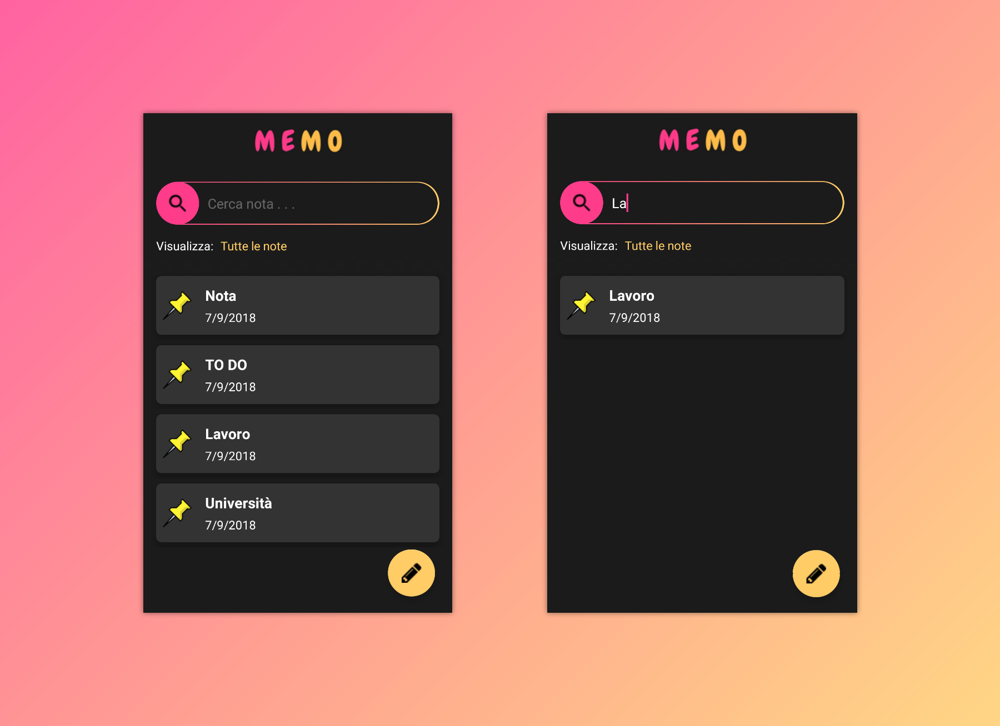
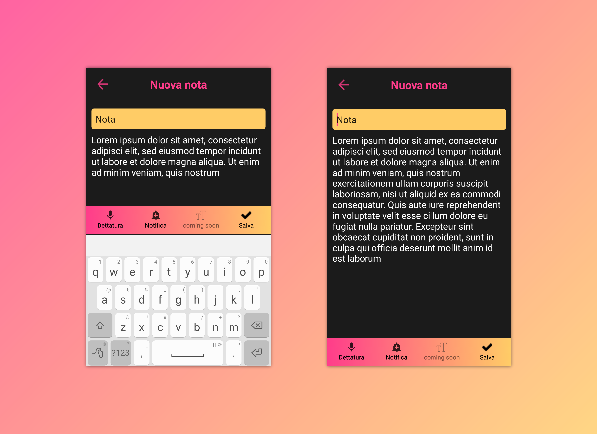
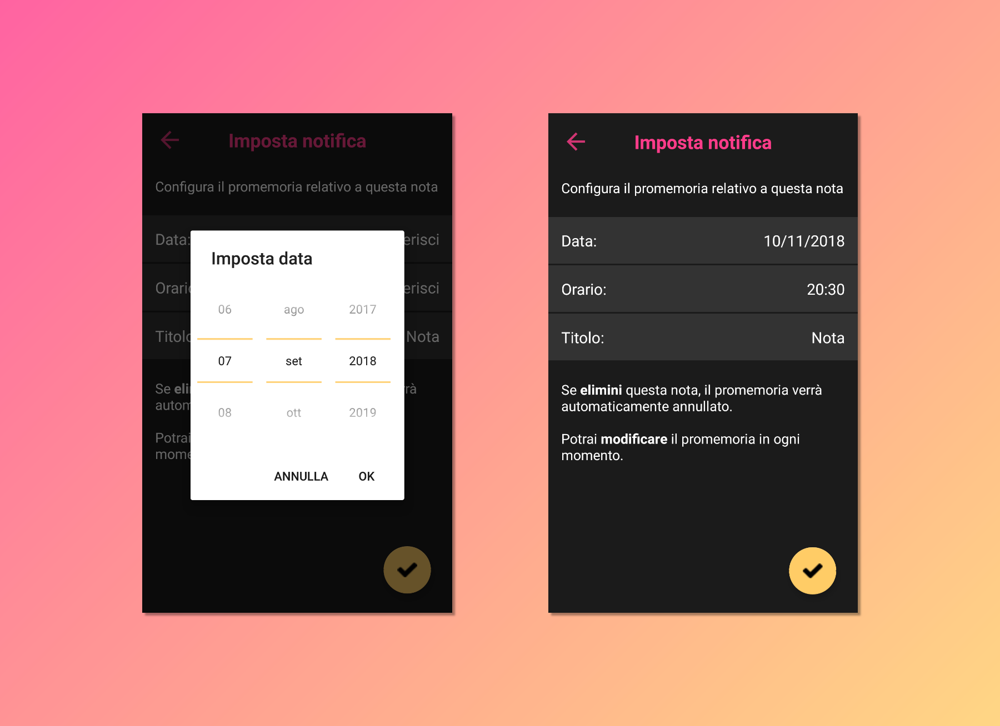

# Memo

Memo is an Android app to take notes and schedule reminders. 
I made (and currently I'm updating) this app as exercise on UI/UX design and Notifications/Alert in Android.

## Download
Check the  to download the latest version.

## Screenshots
  

## Features
* Create/delete note (swipe to delete)
* Real-time note filtering
* Voice dictation
* Add/remove reminder
### Coming soon
* Text formatting
* Categories
* English version

## Contributing

Please fork this repository and contribute back using pull requests.
Any contributions, large or small, major features, bug fixes, unit/integration tests are welcomed and appreciated.

## Authors

* **Angelo Faella** - [AngeloFaella](https://github.com/AngeloFaella)

## License

This project is licensed under the GNU General Public License v3.0 - see the [LICENSE](LICENSE) file for details.
